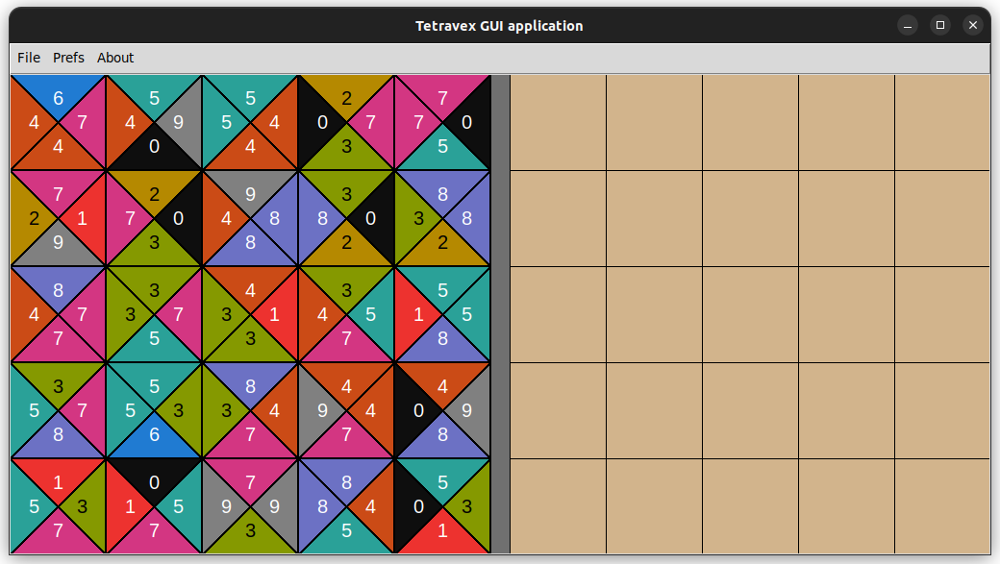

# Tetravex
Edge-matching puzzle game.
Inspired by the Ubuntu "gnome games" version of Tetravex.

## Screenshot: 


## Features
* Tkinter GUI
* Many playable level sizes
* Visual tweaks via preferences menu
* Hint feature

## Linux Setup:
First, if you do not have Tkinter already, use the following command to install it:
```bash
sudo apt-get install python3-tk
```

Next, create a Python virtual environment at the root directory level:
```bash
python3 -m venv venv
source venv/bin/activate
which python3
```

Ensure that you are using the python3 venv and not system python. Pip install requirements:
```bash
which python3
pip install -r requirements.txt
```

Run the program:
```bash
cd src/
./main.py
```

## Contributions
This is a work-in-progress learning project to learn GUI management in Tkinter. <br>
Please submit a pull request and I can review any suggestions.

# License

MIT License (MIT)

Copyright (c) 2025 LoganARichey

Permission is hereby granted, free of charge, to any person obtaining a copy
of this software and associated documentation files (the "Software"), to deal
in the Software without restriction, including without limitation the rights
to use, copy, modify, merge, publish, distribute, sublicense, and/or sell
copies of the Software, and to permit persons to whom the Software is
furnished to do so, subject to the following conditions:

The above copyright notice and this permission notice shall be included in
all copies or substantial portions of the Software.

THE SOFTWARE IS PROVIDED "AS IS", WITHOUT WARRANTY OF ANY KIND, EXPRESS OR
IMPLIED, INCLUDING BUT NOT LIMITED TO THE WARRANTIES OF MERCHANTABILITY,
FITNESS FOR A PARTICULAR PURPOSE AND NONINFRINGEMENT. IN NO EVENT SHALL THE
AUTHORS OR COPYRIGHT HOLDERS BE LIABLE FOR ANY CLAIM, DAMAGES OR OTHER
LIABILITY, WHETHER IN AN ACTION OF CONTRACT, TORT OR OTHERWISE, ARISING FROM,
OUT OF OR IN CONNECTION WITH THE SOFTWARE OR THE USE OR OTHER DEALINGS IN
THE SOFTWARE.
